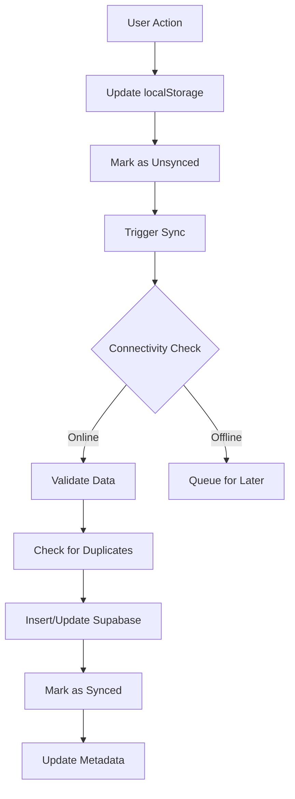
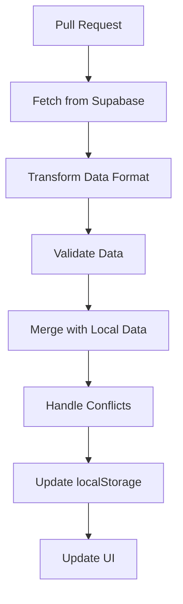

# Sync System Documentation

## Overview

The sync system is the core of the application's offline-first architecture. It provides robust, bi-directional data synchronization between local storage and Supabase, with comprehensive error handling, conflict resolution, and data validation.

## Architecture

### Sync Service Hierarchy

```
SyncService (Main Orchestrator)
    ├── SyncStatusManager (Status tracking & notifications)
    ├── SyncOrchestrator (Orchestrates full sync operations)
    ├── DataPullManager (Handles data retrieval from server)
    └── Component Sync Services
        ├── ProductSync
        ├── CustomerSync
        ├── SalesSync
        └── CreditTransactionSync
```

### Supporting Services

```
SyncOrchestrator
    ├── ConnectivityService (Network connectivity checks)
    ├── NetworkRetryService (Retry logic with exponential backoff)
    ├── SyncValidationService (Data validation & consistency)
    ├── SyncStepExecutor (Individual sync step execution)
    ├── SyncMetadataManager (Metadata & metrics tracking)
    └── TransactionWrapper (Database transaction management)
```

## Core Components

### 1. SyncService (`src/services/syncService.ts`)

The main entry point for all sync operations.

**Key Methods:**
- `syncAll()`: Performs complete bi-directional sync
- `pullFromSupabase()`: One-way sync from server to local
- `getSyncStatus()`: Returns current sync status
- `checkConnectivity()`: Tests network connectivity
- `onSyncStatusChange()`: Subscribe to status updates

**Example Usage:**
```typescript
import { syncService } from '@/services/syncService';

// Perform full sync
const result = await syncService.syncAll();

// Subscribe to status changes
const unsubscribe = syncService.onSyncStatusChange((status) => {
  console.log('Sync status changed:', status);
});
```

### 2. SyncOrchestrator (`src/services/sync/syncOrchestrator.ts`)

Orchestrates the complete sync process with proper error handling and validation.

**Sync Process:**
1. **Connectivity Check** - Verify network availability with retry logic
2. **Pre-sync Validation** - Validate database state before sync
3. **Local Data Cleanup** - Remove duplicates and fix data inconsistencies
4. **Data Consistency Check** - Ensure local data integrity
5. **Dependency-Ordered Sync** - Sync in proper order (Products → Customers → Sales → Credit Transactions)
6. **Post-sync Validation** - Verify sync completion and data consistency
7. **Metadata Update** - Update sync timestamps and metrics

**Transaction Wrapping:**
Each sync step is wrapped in a database transaction to ensure atomicity:

```typescript
totalSynced += await syncStepExecutor.syncWithTransactionWrapper(
  'products', 
  () => syncStepExecutor.syncProducts(errors)
);
```

### 3. SyncStatusManager (`src/services/sync/syncStatusManager.ts`)

Manages sync status tracking and provides real-time status updates to the UI.

**Status Properties:**
```typescript
interface SyncStatus {
  isOnline: boolean;
  lastSync: Date | null;
  pendingSyncs: number;
  errors: string[];
  connectivity?: {
    online: boolean;
    latency?: number;
    error?: string;
  };
  metrics?: {
    successRate: number;
    averageLatency: number;
    totalRetries: number;
    lastSyncDuration: number;
  };
}
```

### 4. Data-Specific Sync Services

#### ProductSync (`src/services/sync/productSync.ts`)
- Handles product catalog synchronization
- Manages inventory levels and product metadata
- Ensures product mapping for sales dependencies

#### CustomerSync (`src/services/sync/customerSync.ts`)
- Synchronizes customer information
- Handles duplicate detection by phone number
- Maintains customer-sale relationships

#### SalesSync (`src/services/sync/salesSync.ts`)
- Complex sync for sales and sale items
- Maintains referential integrity between sales and products
- Handles payment type validation

#### CreditTransactionSync (`src/services/sync/creditTransactionSync.ts`)
- Manages credit transactions
- Links to customer and sale records
- Maintains credit balance consistency

## Sync Process Flow

### 1. Outbound Sync (Local → Server)



### 2. Inbound Sync (Server → Local)



## Conflict Resolution

The sync system uses timestamp-based conflict resolution:

1. **Server Wins**: For most conflicts, server data takes precedence
2. **Merge Strategy**: Combine local and server changes when possible
3. **User Notification**: Alert users to significant conflicts

### Conflict Detection
- Compare `updated_at` timestamps
- Check for data integrity violations
- Identify missing dependencies

### Resolution Strategies
- **Products**: Server data wins, preserve local quantity adjustments
- **Customers**: Merge contact information, preserve relationships
- **Sales**: Server data wins, validate item consistency
- **Credit Transactions**: Server data wins, recalculate balances

## Error Handling

### Error Categories

1. **Network Errors**
   - Connection timeouts
   - Intermittent connectivity
   - Server unavailability

2. **Data Validation Errors**
   - Schema mismatches
   - Missing required fields
   - Invalid data formats

3. **Constraint Violations**
   - Foreign key conflicts
   - Unique constraint violations
   - Business rule violations

### Retry Logic

The system implements exponential backoff for transient errors:

```typescript
interface RetryOptions {
  maxRetries: number;        // Default: 3
  timeoutMs: number;        // Default: 30000
  backoffMultiplier: number; // Default: 2
}
```

### Error Recovery

1. **Automatic Recovery**: Retry transient errors with backoff
2. **Manual Recovery**: Allow users to force sync after errors
3. **Data Recovery**: Pull fresh data from server to resolve conflicts
4. **Error Logging**: Store detailed error information for debugging

## Sync Validation

### Pre-sync Validation (`syncValidationService.ts`)

- **Database State Check**: Verify Supabase connectivity and schema
- **Local Data Cleanup**: Remove orphaned records and duplicates
- **Data Consistency**: Ensure referential integrity

### Post-sync Validation

- **Sync Completion**: Verify all records were processed
- **Data Integrity**: Check for missing dependencies
- **Metric Updates**: Record sync performance data

## Performance Optimization

### Batch Operations
- Group related operations into transactions
- Minimize database round trips
- Use bulk insert/update operations where possible

### Incremental Sync
- Only sync changed records (tracked by `synced` flag)
- Use timestamps to identify recent changes
- Implement delta sync for large datasets

### Connection Management
- Implement connection pooling
- Use keep-alive for persistent connections
- Graceful degradation for poor connectivity

## Monitoring and Metrics

### Sync Metrics (`syncMetricsService.ts`)

Tracks comprehensive sync performance data:

```typescript
interface MetricsSnapshot {
  timestamp: Date;
  totalOperations: number;
  successRate: number;
  averageLatency: number;
  errorCount: number;
  retryCount: number;
}
```

### Metadata Management (`syncMetadataManager.ts`)

Stores sync metadata in localStorage:
- Last sync timestamp
- Sync duration
- Error history
- Performance metrics

## UI Integration

### Sync Status Widget (`components/SyncStatusWidget.tsx`)

Provides real-time sync status display:
- Online/offline indicator
- Last sync timestamp
- Sync progress indication
- Error notifications

### Sync Actions (`components/sync/SyncActionButtons.tsx`)

User controls for manual sync operations:
- Force full sync
- Pull from server
- Sync status display

## Database Triggers

The system uses database triggers to track changes:

```sql
-- Automatic sync logging for all data changes
CREATE TRIGGER trigger_log_products_sync_change
    AFTER INSERT OR UPDATE OR DELETE ON public.products
    FOR EACH ROW EXECUTE FUNCTION public.log_sync_change();
```

This ensures all server-side changes are logged for proper sync coordination.

## Configuration

### Sync Settings

Configure sync behavior through environment variables or settings:

```typescript
const syncConfig = {
  autoSyncInterval: 300000,  // 5 minutes
  retryDelay: 5000,          // 5 seconds
  maxRetries: 3,
  batchSize: 100,
  timeoutMs: 30000
};
```

### Connectivity Settings

Network connectivity detection and retry configuration:

```typescript
const connectivityConfig = {
  checkInterval: 30000,      // 30 seconds
  testTimeout: 10000,        // 10 seconds
  retryBackoff: 2,           // Exponential backoff
  maxRetries: 3
};
```

## Best Practices

1. **Always Use Transactions**: Wrap multi-step operations in transactions
2. **Validate Before Sync**: Check data integrity before attempting sync
3. **Handle Partial Failures**: Continue processing even if some operations fail
4. **Provide User Feedback**: Keep users informed of sync status and errors
5. **Log Comprehensively**: Maintain detailed logs for troubleshooting
6. **Test Offline Scenarios**: Thoroughly test offline-to-online transitions
7. **Monitor Performance**: Track sync metrics and optimize bottlenecks

## Troubleshooting

### Common Issues

1. **Sync Stuck**: Check connectivity and error logs
2. **Data Inconsistency**: Run full data pull from server
3. **Performance Issues**: Check batch sizes and connection settings
4. **Duplicate Records**: Verify unique constraints and duplicate detection logic

### Debug Tools

- Console logging with detailed operation tracking
- Sync status widget for real-time monitoring
- localStorage inspection for local data state
- Supabase dashboard for server-side data verification

## Future Enhancements

- Implement selective sync (choose which data to sync)
- Add conflict resolution UI for user decision-making
- Implement real-time sync using Supabase realtime subscriptions
- Add sync scheduling and customizable intervals
- Implement data compression for large sync operations